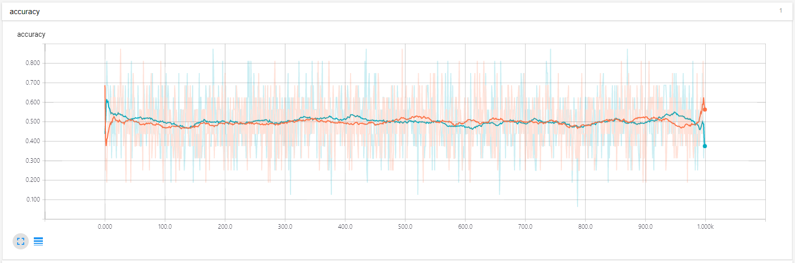
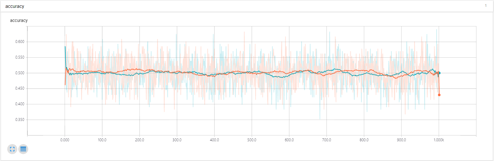
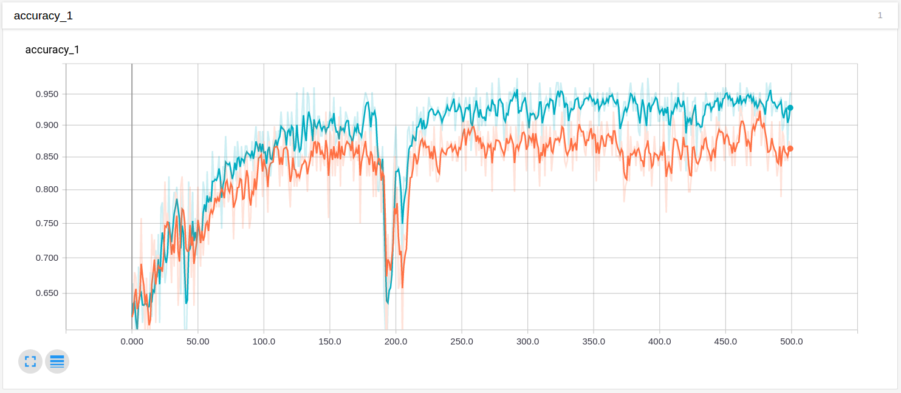
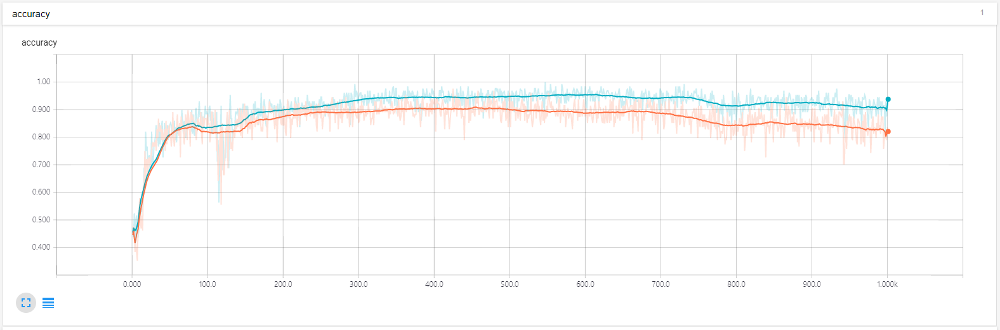

# Report
#### 17 July 2017

# Common Setting
#### Device Specifications
* CPU: Intel(R) Xeon(R) CPU E5-2640 v4
* GPU: NVIDIA GeForce GTX1070 1x

#### Dataset Description
* Training Set: 800+800
* Test Set:     200+200
* Resolution:   224x224x3

(Note: All abnormal data are from the subclass 1/0)

# Try1
#### Model Architecture
* VGG16 (Simonyan & Zisserman, 2015), Updating only last 3FC(Fully connected layer)s

#### HyperParameters
* Learning Rate: 0.001
* Batch Size:    16
* Iteration:     1000

(Note: Batch size was set to 16 to fit the available GPU memoery capacity.) 

#### Accomplishments
* Nothing, indisputable failure.

#### Limitations
* Accuracy oscillates around 0.5, which is nothing more than simple guess following the distribution of the data.
* Too many parameters, which makes increasing batch size unfeasible.

#### Evaluation
* For now, implementing ResNet architecture cannot help as the number of parameters required is larger than VGG16.
* For the same reason, using Inception-v1 might could be a solution since it allows bigger batch size
* Maybe the number of iterations could have been too small.

# Try2
#### Model Architecture
* Inception-v1 + 3FCs (Szegedy et al., 2014)

(Note: The original Inception-v1 architecture doesn't have 3 following full connected layers.) 
#### HyperParameters
* Learning Rate: 0.001	
* Batch Size:    128	
* Iteration:     1000

#### Accomplishments
* It is confirmed that it is possible to run the model with currently available device, as Inception-v1 dramatically reduces the number of parameters required - 1/6 of VGG16.

#### Limitations
* Accuracy still doesn't converge.

#### Evaluation
* It might be even better if we could obtain pretrained weights of v2, v3 of Inception model.
* Still, it is proven that without modifying inputs by any means, learning is impossible.

# Try3
#### Model Architecture
* Inception-v1 + 3FCs with BN(batch normalisation) (Ioffe & Szegedy, 2015)

#### HyperParameters
* Learning Rate: 0.001	
* Batch Size:    128	
* Iteration:     1000

#### Accomplishments
* Finally showed some evidence that the model can learn.
* Found a way to detour PCA Whitening, which requires huge computation
* ... and dropout algorithm, which slows down learning speed.

#### Limitations
* Although accuracy seems to increase rapidly at the beginning of the iterations, after some point it returns to 0.5 level and oscillates around there.
* It is still unsure whether the learning was possible because the model could really detect the relevant features or just detected co-occuring irrelevant features (e.g. skeletal structure)

#### Evaluation
* It would be worth trying to set the learning rate small, since it seems that the accuracy escapes from the well performing region.

# Try4
#### Model Architecture
* Inception-v1 + 3FC with BN

#### HyperParameters
* Learning Rate: 0.0001
* Batch Size:    128
* Iteration:     1000

#### Accomplishments
* Stabilised learning
* Enhanced accuracy

#### Limitations
* Test accuracy seemed to worsen after some iterations.

#### Evaluation
* We need to devise some method to inspect whether the model is really learning relevant features.
* It is also required to further stabilise the model.

# Further considerations
* Since we don't update parameters at convoultion layers, we can build a pipeline through which all images are filtered into feature vectors and save the feature vectors as input data. By doing so, we can increase resolution and depth of fully connected layers and save computing time.
* It is required to find some way to inspect which features the model is inspecting.
