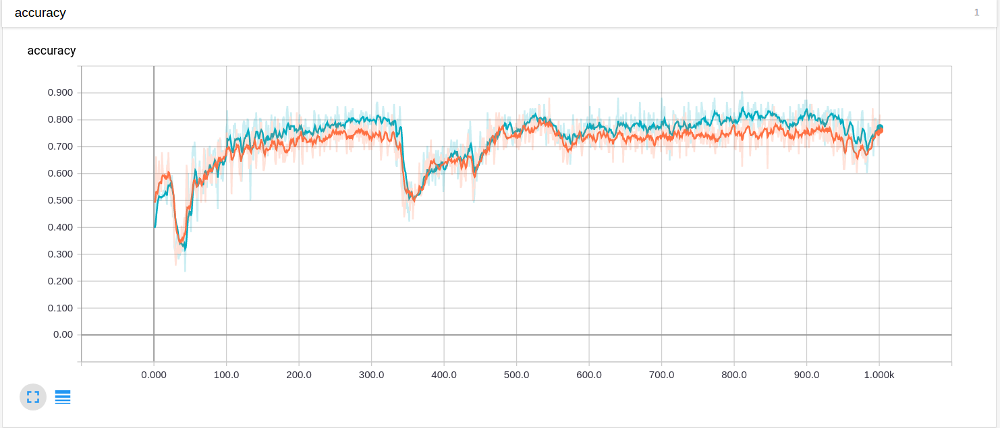
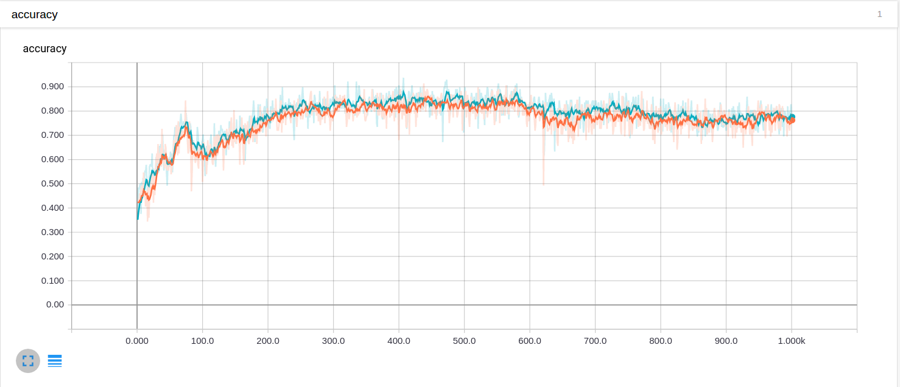
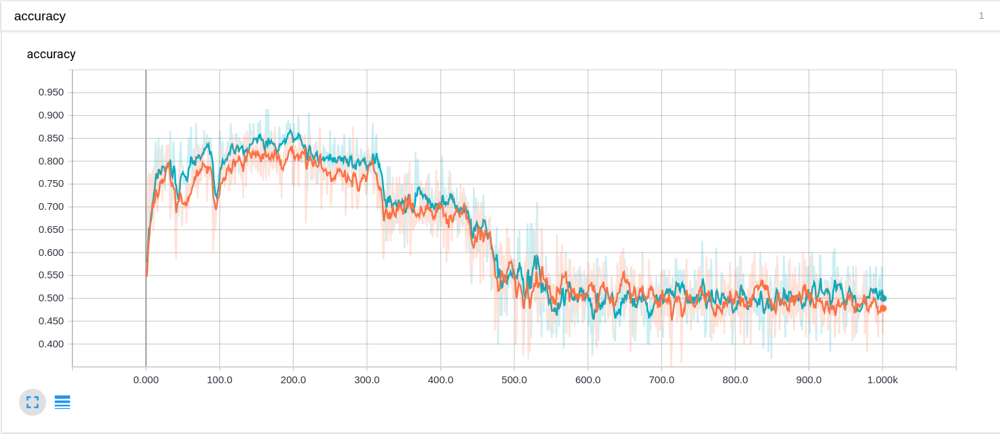

# Report
#### 1 August 2017

# Common Settings
#### Device Specifications
* CPU: Intel(R) Core(TM) i7-6700K CPU
* GPU: NVIDIA GeForce GTX1080 Ti x2

# Try5
#### Model Architecture
* Inception-v1 + 3FCs with BN
* 7x7 average pooling layer at the end of convolutions were replace by 14x14 average pooling layer to fit in to the network.

#### Dataset Description
* Training Set: 800+800
* Test Set:     200+200
* Resolution:   448x448x3

#### HyperParameters
* Learning Rate: 0.0001
* Batch Size:    64 + 64
* Iteration:     1000

#### Accomplishments
* Found way to fit data that don't fit to the original architecture.

#### Limitations
* Worse performance that training with 224x224 data.
* Learning is rather unstable

#### Evaluation
* Because of more extreme pooling at the end of convolution layers, it

# Try6
#### Model Architecture
* Inception-v1 + 3FCs with BN
* 7x7 average pooling layer is kept.
* The first FC layer receives 4x more variables.

#### Dataset Description
* Training Set: 800+800
* Test Set:     200+200
* Resolution:   448x448x3

#### HyperParameters
* Learning Rate: 0.0001
* Batch Size:    64 + 64
* Iteration:     1000

#### Accomplishments
* Better performance, approx 0.10 better than Try4.
* Stabilised learning, especially after convergence.

#### Limitations
* Expensive computation - approx. 1700 sec, compared to approx. 500 sec. with 224x224 data.

#### Evaluation

# Try7
Inspired by the task J.Choi is doing.

#### Model Architecture
* Inception-v1 + 3FCs with BN

#### Dataset Description
* Training Set: 400+400 
* Test Set:     100+100
* Resolution:   224x224x3
* Only lungs are segmented

#### HyperParameters
* Learning Rate: 0.0001
* Batch Size:    64 + 64
* Iteration:     1000

#### Accomplishments

#### Limitations
* Performance is not much different from tries with unsegmented dataset.
* The performance curve shows a similar behaviour as Try3.

#### Evaluation
* There seems to be room for improvement by tuning hyperparameters.
* We need to test whether segmentation contributes to imporvement in performance. If it turns out to be so, research on more sophisticated segmentation would be worth doing.

# Some Report on Parralelisation
* Computation speed doesn't seem to improve much.
* Memory capacity is expanded, so that we can try bigger models when needed.
* TensorFlow doesn't seem to support a handy API to merge gradients.