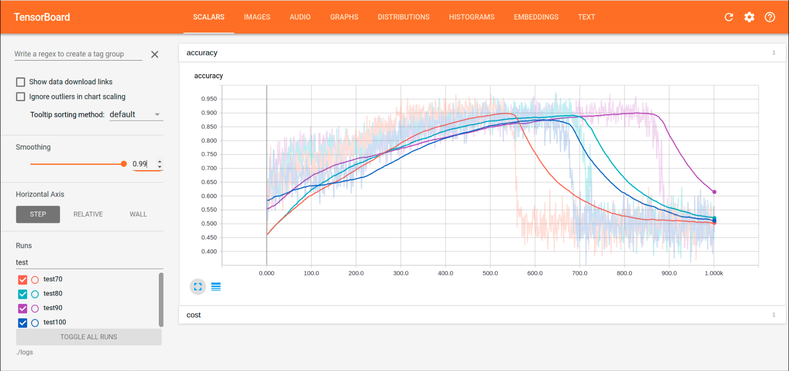
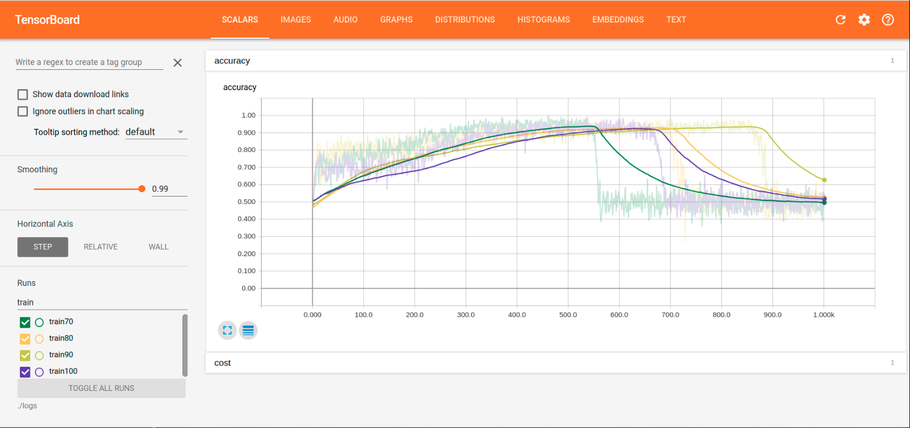
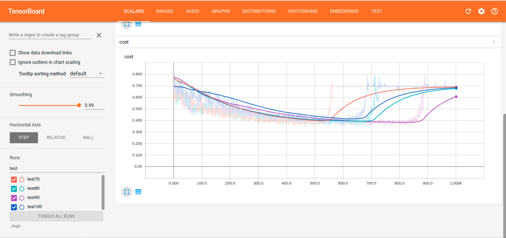

# Report
#### 10 August 2017

# Common Settings
#### Device Specifications
* CPU: Intel(R) Core(TM) i7-6700K CPU
* GPU: NVIDIA GeForce GTX1080 Ti 2x

Inspired by the two findings:
* Increased resolution contributes to the improvement on performance.
* Using cropped data contributes to the improvement of learning speed.

The more cropped the data, the faster the learning rate. This observation can be ascribed to that the cropped images only contain partitions relevant to the classification. 