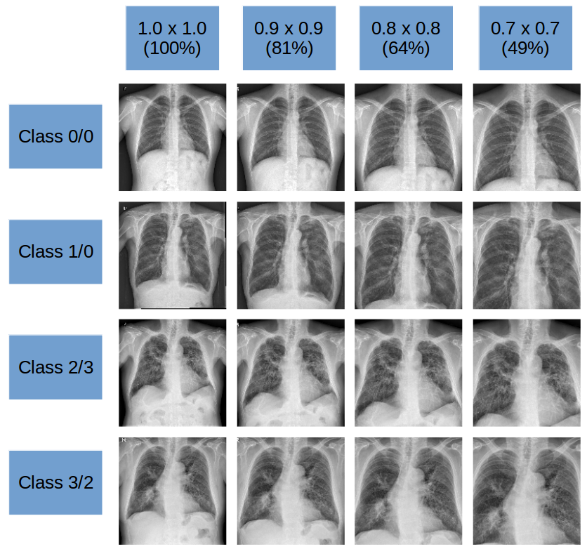
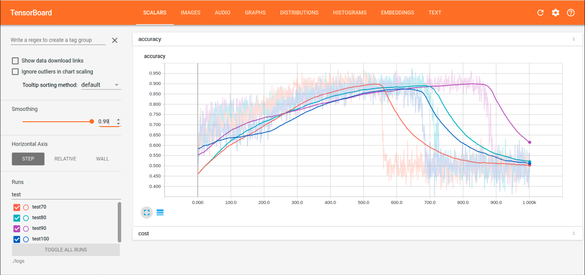
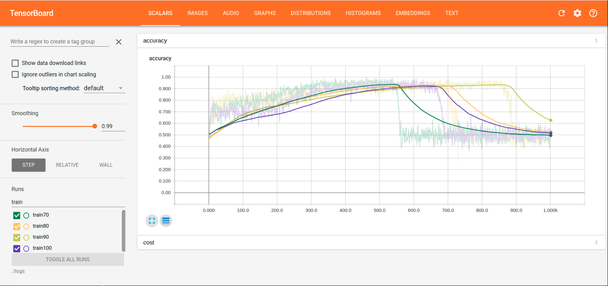
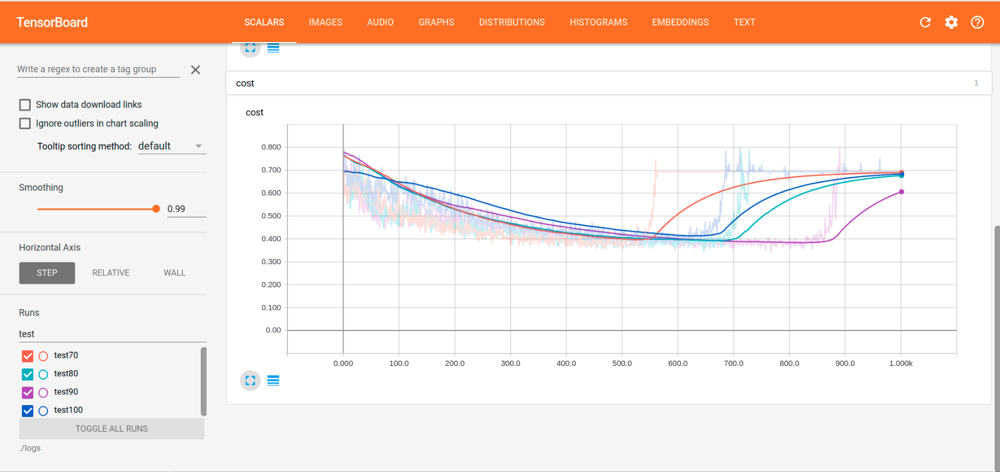
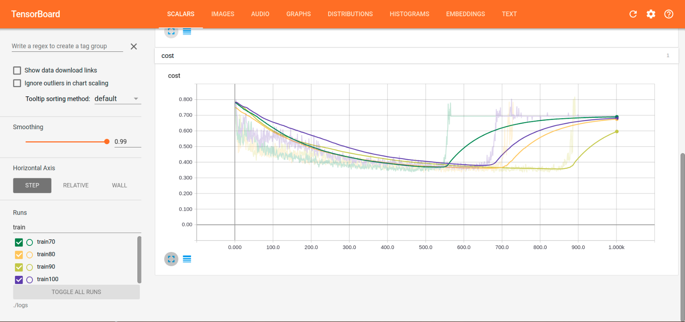
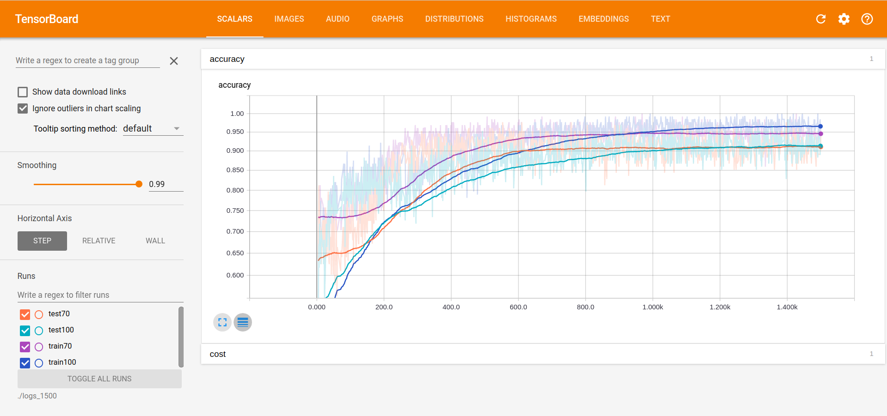
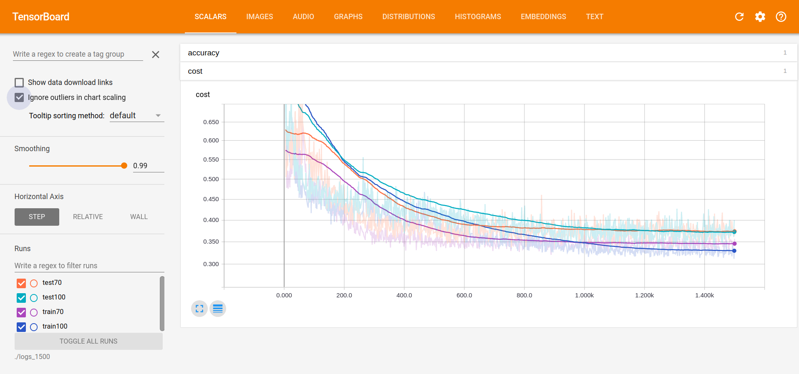
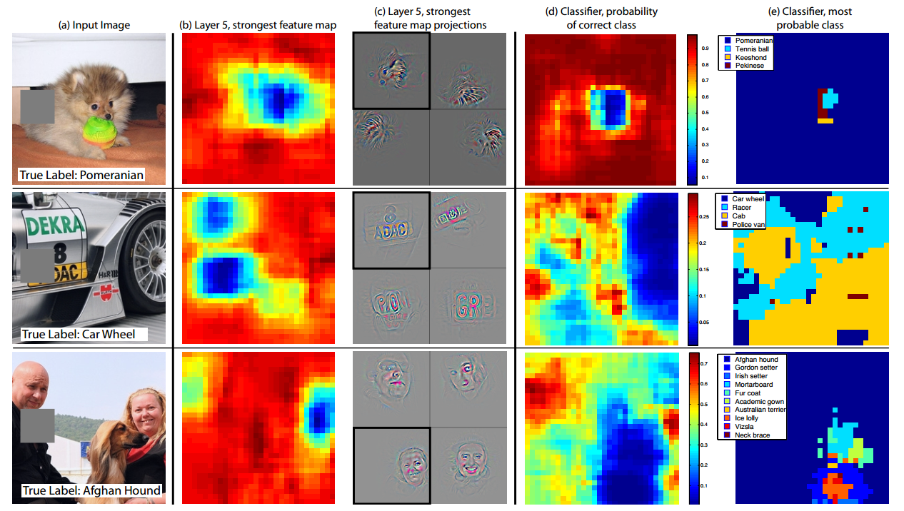

## Report
#### 17 August 2017

## Common Settings
#### Device Specifications
* CPU: Intel(R) Core(TM) i7-6700K CPU
* GPU: NVIDIA GeForce GTX1080 Ti 2x

#### Model Architecture
(Following the Same Architecture of Try 6)
* Inception-v1 + 3FCs with BN
* 7x7 average pooling layer is kept.
* The first FC layer receives 4x more variables 

## Comparison of Performance between Training with Raw Data and Cropped Data

Inspired by the two findings:
* Increased resolution contributes to the improvement on performance.
* Using cropped data contributes to the improvement of learning speed.

#### Overview of Cropped Dataset

* The quality of area cropped doesn't seem to be affected by the class of image, but rather more affected by the position of individual patients itself. Still simply cropping from all sides except for the top side gave reasoable results. As this was an probe trial, I felt it was fine to use this dataset.
* Cropping each sides to 0.7 of its orginal length results in approx. 2 times higher resolution.

#### Performance Comparision

* The more cropped the data, the faster the learning rate. This observation can be ascribed to that the cropped images only contain partitions relevant to the classification or simply increase resolution.
* Although the learning rates differ by the amount of cropping, the final accuracies they converge don't show much difference
* Watching the cost curve, it is quite certain that such problem is caused by pure computing issuses, e.g. NaN or zero division.

#### For more detailed inspection

* More precise tuning was done on learning rate in order to avoid problems obe
* The learning curve with full image dataset reaches 1.0, whereas that of 70% cropped dataset reaches only few times.

## Tries on Classification by a Specific Class Label
#### Difficulties
* Differences between classes are now as obivious as the difference between normal cases and abnormal cases.
* Lack of abnormal samples for targeted classification.
* ... still some seemed feasible.

#### Available Resources

| Class            | Size of Sample |
| :--------------: |:-------------: |
| C < 00           | 1000           |
| 00 <= C <10      | 107            |
| 10 <= C < 21     | 498            |
| 21 <= C < 32     | 450            |
| 32 <= C          | 107            |

## Case 1 : Threshold = 1/0
#### Motivation
* Except for class 0, class 1 and class 2 on their own have reasonable size. So the first task was set on discrimination between these two.

#### Dataset Description
* Cropped: 		0.7*0.7
* Training Set: 432+432
* Test Set:     108+108
* Resolution:   448x448x3

#### HyperParameters
* Learning Rate: 0.0001
* Batch Size:    64 + 64
* Iteration:     1000

#### Evaluation
* Worked quite well, but not as good as previous tasks, as expected.

#### Limitations
* Potentially due to the small dataset, the network doesn't learn much.

## Further Considerations
* Visualisation and quantification of activations with ZFNet, so that we can have firm evidence of benefit of having more focused dataset.

* It will also help us address the relation to the methodology with SVMs and the wavelet transformation.
* Utilising object detection algorithms

## Reference

* [Zeiler & Fergus, 2013](https://arxiv.org/abs/1311.2901)